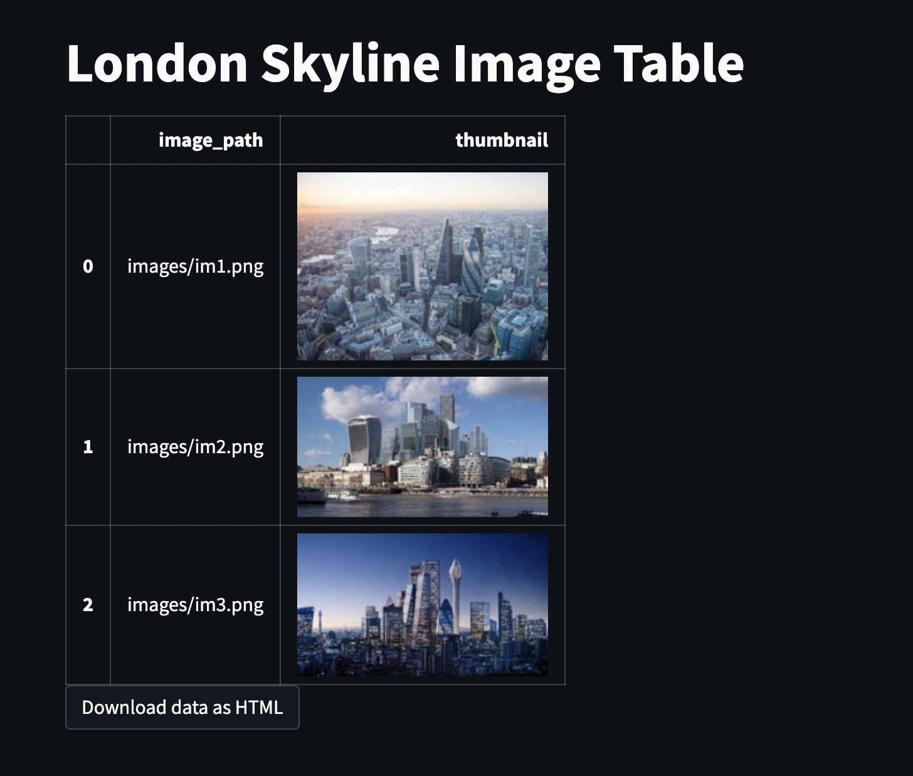

# streamlit-image-table-pandas-app
Place images in a table using pandas and generate a shareable report. Fork of [this example](https://github.com/dataprofessor/st-demo-image-table) discussed on [this thread](https://discuss.streamlit.io/t/embedding-image-links-in-table-doesnt-show-image-saving-to-html-does/21751). Modification here is to encode the image as a base64 string, which means that the html file can be shared with anyone (e.g. via email) and the images will still render. If local paths are used the images will not render because they will not be present on the recipients machine. The html can then be saved as a pdf using chrome.

## Development
* Create and activate a venv: `python3 -m venv venv` and `source venv/bin/activate`
* Install requirements: `pip install -r requirements.txt`
* Run app: `streamlit run app.py`